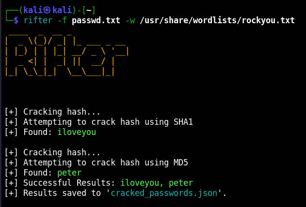
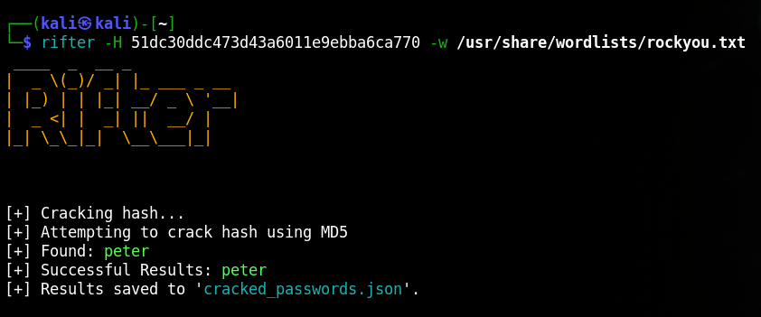

<p align="center">
  
</p>

<p align="center">
  
  
  
  
   
</p>

<p align="center">
 
   
 </p>

**Rifter** is a powerful and efficient hash-cracking tool designed for cybersecurity professionals and enthusiasts. It is capable of cracking various cryptographic hashes using dictionary attacks, brute-force techniques, or hybrid methods. Ideal for auditing password strength, Rifter helps ensure the security of hashed credentials in your systems.

<div align="center">

---

**[<kbd> <br> Install <br> </kbd>][Install]** 
**[<kbd> <br> Usage <br> </kbd>][Usage]** 
**[<kbd> <br> Flags <br> </kbd>][flags]** 
**[<kbd> <br> Output <br> </kbd>][output]** 

---

</div>

[Flags]: #flags
[Install]: #Installation
[Ouput]: #Output
[Usage]: #Usage


## Features
**1. Multi-Algorithm Support**
- Supports popular hash algorithms, including MD5, SHA-1, SHA-256, and more.

**2. Supported Hashes**
- Md5, SHA1, SHA256, SHA384, SHA512.

**3. Wordlist Customization**
- Allows the use of custom wordlists to test against common and uncommon password patterns.

**4. Multi-Threaded Cracking**
- Utilizes multi-threading to improve cracking speed and efficiency.

**5. Hash Format Detection**
- Automatically detects the type of hash provided for seamless operation.

**6. Modular Design**
- Designed to add support for new algorithms or cracking techniques easily.

---

## Installation on Linux <a name="installation"></a>

To run Rifter, you need Python/Python3 installed. Clone the repository and install the required dependencies.

**Clone the Repository:**

```python
git clone https://github.com/SOORAJNAIR-IS-HERE/Headex.git
```
**Navigate to the Project Directory**

```python
cd Netnab
```
## Running globally in Linux

Move to bin Directory

```python
sudo mv netnab /usr/local/bin
```
```python
netnab <Target>
```

# Usage <a name="usage"></a>

```python
python netnab <Target>
```
**To scan Multiple Targets**

```python
netnab <Target> <Target>
```
## Flags <a name="flags"></a>

```html

-h  | help message

-H  | Hash

-f  | Hash file

-w  | Custom wordlist

-A  | Hash mode [md5, sha1, sha256, sha384, sha512]

-P  | Number of Process

-s  | Salted Hash

```

## Install the Required Dependencies

**Update the package list**
```python
sudo apt update
```
**Install Python 3**
```python
sudo apt install python3
```
**Verify the installation**
```python
python3 --version
```
# output

<p align="center">
  
</p>
<p align="center">
  
</p>


